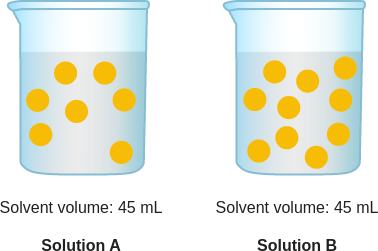
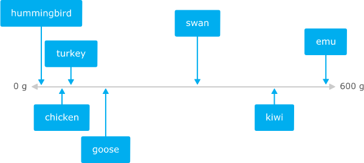

# HW3: Reproduce LLaVA

## Reproduce Evaluation on ScienceQA

无法区分数目:4351

无法读出文字类内容:16501

## Reproduce Instruction Fine-tuning Data Generation

We reproduced an example for each data type using the GPT4 web version.

### Conversation

*Prompt*

You are an AI visual assistant, and you are seeing a single image. What you see are provided with five sentences, describing the same image you are looking at. Answer all questions as you are seeing the image.

Design a conversation between you and a person asking about this photo. The answers should be in a tone that a visual AI assistant is seeing the image and answering the question.
Ask diverse questions and give corresponding answers.

Include questions asking about the visual content of the image, including the object types, counting the objects, object actions, object locations, relative positions between objects, etc. Only include questions that have definite answers:
(1) one can see the content in the image that the question asks about and can answer confidently;
(2) one can determine confidently from the image that it is not in the image.
Do not ask any question that cannot be answered confidently.

Also include complex questions that are relevant to the content in the image, for example, asking about background knowledge of the objects in the image, asking to discuss about events happening in the image, etc. Again, do not ask about uncertain details.
Provide detailed answers when answering complex questions. For example, give detailed examples or reasoning steps to make the content more convincing and well-organized.  You can include multiple paragraphs if necessary:

There is a movie theater that displays the show times above the doors.
A red fire hydrant is deep in the snow.
The fire hydrant is in the snow near a recently plowed sidewalk.
This city has had a very hard winter with snow.
A hotel for dogs in the snow in winter.

*Response*

**Person:** What objects can you see in the image you're looking at?

**AI Visual Assistant:** In the image, I can see a red fire hydrant that is almost buried in the snow, positioned near a sidewalk that appears to have been recently plowed.

**Person:** How severe does the winter appear to be in the image?

**AI Visual Assistant:** The winter depicted in the image appears to be quite severe. The snow accumulation is significant, enough to nearly cover the fire hydrant, which suggests recent heavy snowfall. The presence of a plowed sidewalk also indicates active efforts to manage the snow, which is typical in harsh winter conditions.

**Person:** Can you tell me if there are any signs indicating locations or services?

**AI Visual Assistant:** While the image does not show any signs directly related to locations or services, the setting and context imply it is a city environment where snow removal services are operational, as evidenced by the plowed sidewalk. However, specific signs like those for a movie theater or a dog hotel are not visible in this scene.

**Person:** Are there any indicators of how the community might be responding to the winter conditions?

**AI Visual Assistant:** Yes, the community response to the winter conditions can be inferred by the plowed sidewalk near the fire hydrant. This indicates that there are active efforts to keep pedestrian areas accessible, suggesting a prompt and organized response to snowfall, which is essential for safety and mobility in urban areas during severe winter conditions.

**Person:** Discuss the potential challenges and importance of fire hydrant visibility during winter.

**AI Visual Assistant:** Fire hydrant visibility during winter is crucial for emergency services. When hydrants are buried or obscured by snow, it can significantly hinder firefighting efforts during emergencies. Firefighters need quick and easy access to hydrants to combat fires effectively. The challenges include ensuring that hydrants are not only visible but also accessible, which involves regular snow removal around these vital points. Communities often encourage residents to adopt hydrants to keep them clear of snow in winter. This proactive approach is essential for public safety and efficient emergency responses.

### Complex Reasoning

*Prompt*

You are an AI visual assistant that can analyze a single image. You receive five sentences, each describing the same image you are observing. In addition, specific object locations within the image are given, along with detailed coordinates. These coordinates are in the form of bounding boxes, represented as (x1, y1, x2, y2) with floating numbers ranging from 0 to 1. These values correspond to the top left x, top left y, bottom right x, and bottom right y.

The task is to use the provided caption and bounding box information, create a plausible question about the image, and provide the answer in detail.

Create complex questions beyond describing the scene.
To answer such questions, one should require first understanding the visual content, then based on the background knowledge or reasoning, either explain why the things are happening that way, or provide guides and help to user's request.  Make the question challenging by not including the visual content details in the question so that the user needs to reason about that first.

Instead of directly mentioning the bounding box coordinates, utilize this data to explain the scene using natural language. Include details like object counts, position of the objects, relative position between the objects.  

When using the information from the caption and coordinates, directly explain the scene, and do not mention that the information source is the caption or the bounding box.  Always answer as if you are directly looking at the image：

A man wearing multiple neck ties making a goofy face.
A man in a white shirt wearing very many ties.
a man with ties on poses for a picture
A man wearing multiple ties on his neck.
A young man smiles while wearing several ties.

tie: [0.574, 0.298, 0.752, 0.704]
tie: [0.464, 0.339, 0.639, 0.789]
tie: [0.349, 0.363, 0.563, 0.732]
tie: [0.259, 0.255, 0.668, 0.805]
person: [0.019, 0.065, 0.962, 0.988]
person: [0.0, 0.24, 0.214, 1.0]
tie: [0.316, 0.778, 0.443, 0.867]
tie: [0.386, 0.707, 0.496, 0.801]
tie: [0.251, 0.354, 0.402, 0.747]
tie: [0.44, 0.318, 0.63, 0.397]
tie: [0.566, 0.33, 0.655, 0.543]
tie: [0.25, 0.409, 0.359, 0.556]

*Response*

**Question:** Given the unusual attire of the individual in the image, what might be the potential reasons or scenarios behind a young man choosing to wear several ties at once, and how does this reflect on his personality or the context of the photograph?

**Answer:** Observing the scene, the young man prominently displays a collection of ties around his neck, each one varied in position but contributing to a striking and humorous visual effect. The ties range from being tightly clustered around his neck to loosely draped, which suggests that he's intentionally styled them for maximal visual impact rather than practical use. This choice to wear multiple ties, combined with his goofy facial expression, strongly implies that the setting could be a casual, perhaps festive or comedic event where such playful and exaggerated fashion choices are encouraged. This attire could be part of a costume for a party, a quirky personal style statement, or even a humorous protest against conventional dress codes. In any case, his broad smile and the deliberate arrangement of the ties suggest that he is comfortable and enjoying the attention his unique outfit garners. This setting speaks to a playful, creative personality who is not afraid to express himself and enjoys engaging with others in a lighthearted manner.

### Detail Description

*Prompt*

You are an AI visual assistant that can analyze a single image. You receive five sentences, each describing the same image you are observing. In addition, specific object locations within the image are given, along with detailed coordinates. These coordinates are in the form of bounding boxes, represented as (x1, y1, x2, y2) with floating numbers ranging from 0 to 1. These values correspond to the top left x, top left y, bottom right x, and bottom right y.

Using the provided caption and bounding box information, describe the scene in a detailed manner.

Instead of directly mentioning the bounding box coordinates, utilize this data to explain the scene using natural language. Include details like object counts, position of the objects, relative position between the objects.

When using the information from the caption and coordinates, directly explain the scene, and do not mention that the information source is the caption or the bounding box.  Always answer as if you are directly looking at the image.

A harbor filled with lots of boats next to a building.
A bicycle parked in front of several boats at a dock.
A red bicycle in front of a line of docked white yachts
A bike sits before boats which sit before a long building.
A bicycle is a convenient means of land transportation when you live on a boat.

bicycle: [0.287, 0.641, 0.507, 0.874]
bicycle: [0.566, 0.667, 0.63, 0.731]
boat: [0.318, 0.579, 0.575, 0.724]
boat: [0.704, 0.607, 0.818, 0.727]
boat: [0.818, 0.601, 0.942, 0.744]
boat: [0.002, 0.53, 0.243, 0.71]
boat: [0.541, 0.611, 0.668, 0.731]
person: [0.778, 0.527, 0.797, 0.57]
cup: [0.708, 0.733, 0.724, 0.758]
boat: [0.236, 0.532, 0.404, 0.64]
boat: [0.81, 0.632, 0.836, 0.676]
boat: [0.957, 0.526, 1.0, 0.752]

*Response*

In this bustling harbor scene, a collection of boats is neatly aligned along the dock, presenting a picturesque view against a long building in the background. Prominently in the foreground, two bicycles are parked, suggesting a mode of transportation used by either visitors or boat owners. The first bicycle is larger and positioned slightly left of center, while the second, smaller bicycle is towards the right, creating a balanced visual element in the scene.

The boats vary in size and are distributed across the image, with some closer to the viewer and others set against the far edge of the dock. The nearest boats are predominantly white, contrasting nicely against the darker waters. There's a small, almost unnoticed person standing towards the right side of the dock, likely enjoying the serene water view.

Additionally, a solitary cup sits on the edge of the dock near the middle-right, perhaps left behind by a visitor. This scene captures a typical day at the harbor, where leisure meets functionality.